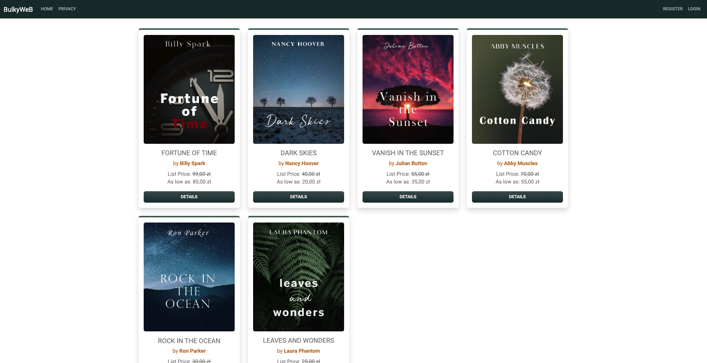

# Bulky Project

### 
This is the project that I've developed line by line from [YouTube course](https://www.youtube.com/watch?v=AopeJjkcRvU&ab_channel=DotNetMastery). 

The main goal was to become familiar with ASP.NET Core MVC by writing application from scratch. This project provided me some basics of how my next projects should look like. 

### Stuff that learned:
- How to develope ASP.NET MVC Pattern
- Entity Framework
- How to Use Razor Pages
- How to use Repository Pattern
- Creating Models, Controlles
- Connecting to database (I've used SQLite)
- Some bacis of Identity ASP.NET Core

## Screenshots

